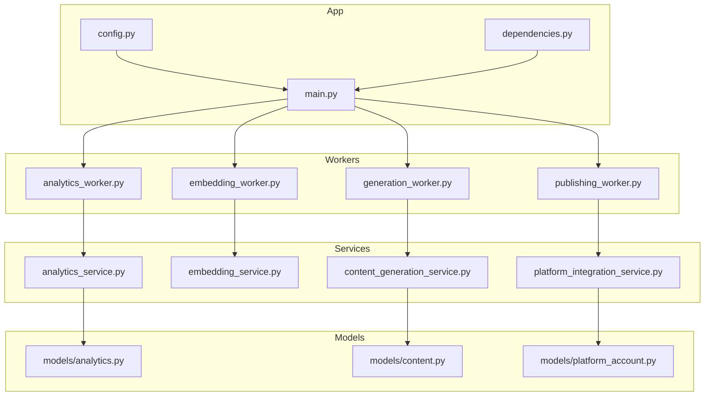
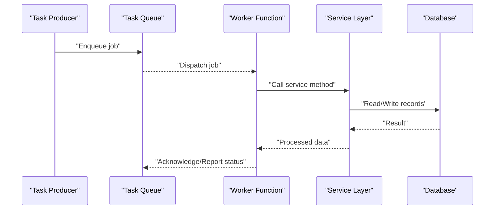
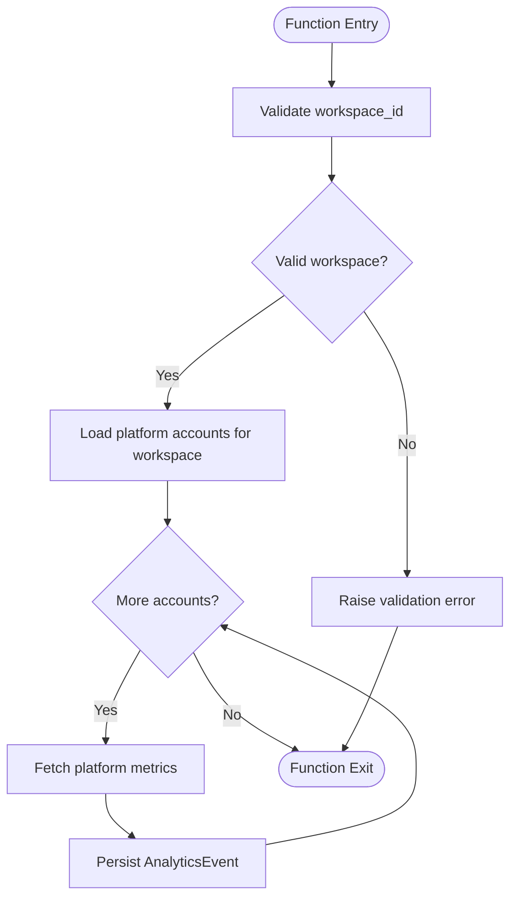
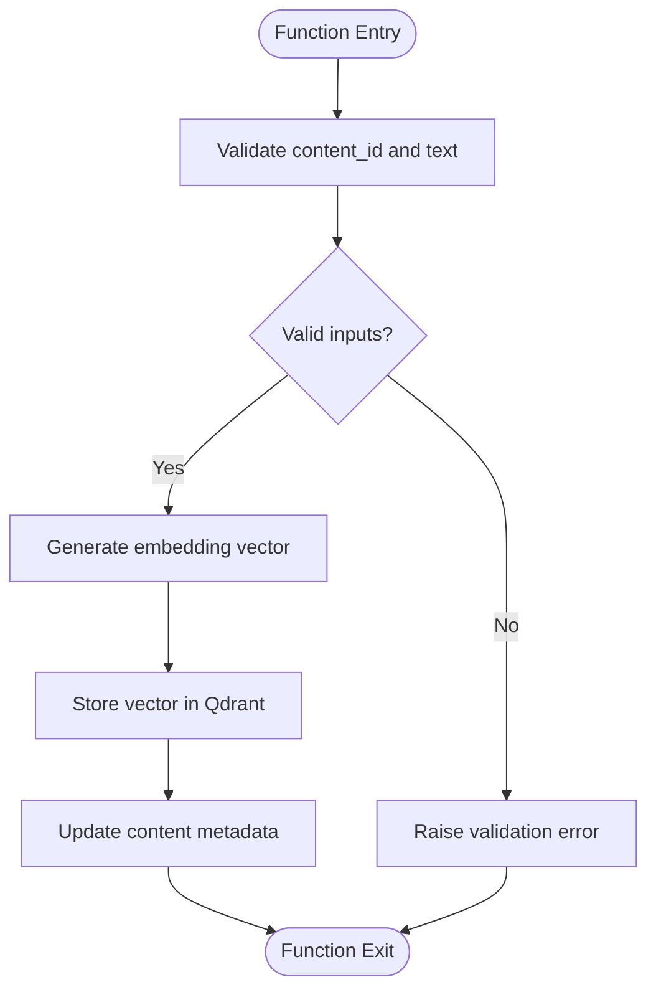
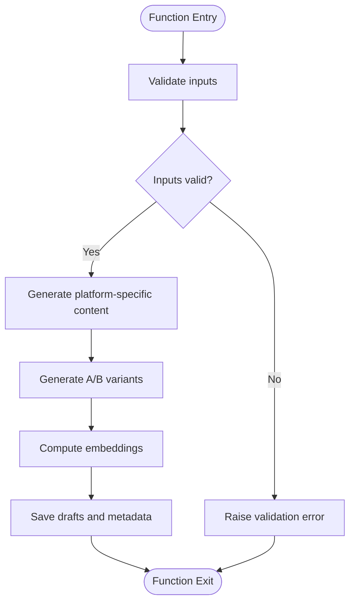
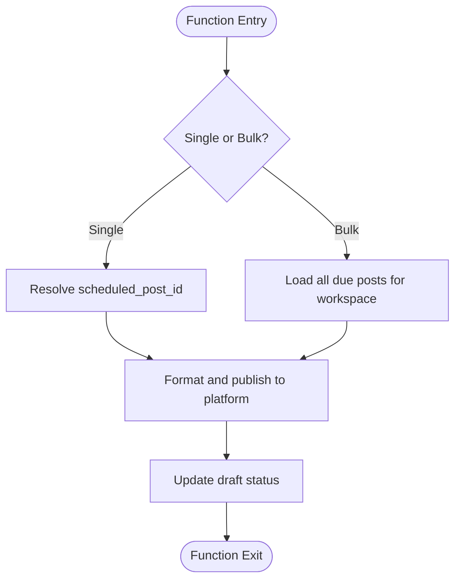
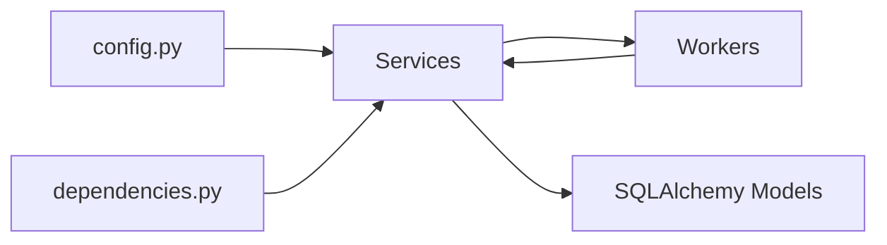
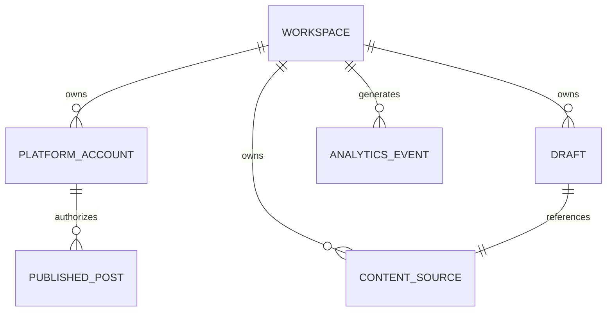

# Worker System

<cite>
**Referenced Files in This Document**
- [backend/app/workers/analytics_worker.py](file://backend/app/workers/analytics_worker.py)
- [backend/app/workers/embedding_worker.py](file://backend/app/workers/embedding_worker.py)
- [backend/app/workers/generation_worker.py](file://backend/app/workers/generation_worker.py)
- [backend/app/workers/publishing_worker.py](file://backend/app/workers/publishing_worker.py)
- [backend/app/main.py](file://backend/app/main.py)
- [backend/app/config.py](file://backend/app/config.py)
- [backend/app/dependencies.py](file://backend/app/dependencies.py)
- [backend/app/services/analytics_service.py](file://backend/app/services/analytics_service.py)
- [backend/app/services/embedding_service.py](file://backend/app/services/embedding_service.py)
- [backend/app/services/content_generation_service.py](file://backend/app/services/content_generation_service.py)
- [backend/app/services/platform_integration_service.py](file://backend/app/services/platform_integration_service.py)
- [backend/app/models/analytics.py](file://backend/app/models/analytics.py)
- [backend/app/models/content.py](file://backend/app/models/content.py)
- [backend/app/models/platform_account.py](file://backend/app/models/platform_account.py)
</cite>

## Table of Contents
1. [Introduction](#introduction)
2. [Project Structure](#project-structure)
3. [Core Components](#core-components)
4. [Architecture Overview](#architecture-overview)
5. [Detailed Component Analysis](#detailed-component-analysis)
6. [Dependency Analysis](#dependency-analysis)
7. [Performance Considerations](#performance-considerations)
8. [Troubleshooting Guide](#troubleshooting-guide)
9. [Conclusion](#conclusion)
10. [Appendices](#appendices)

## Introduction
This document describes Socialium’s background worker system. It explains the task queue architecture, worker process management, and asynchronous task execution patterns. It documents the four main worker types:
- AnalyticsWorker: performance data collection and aggregation
- EmbeddingWorker: vector embedding generation and memory optimization
- GenerationWorker: content creation pipelines and variant processing
- PublishingWorker: platform-specific content publishing and batch operations

It also covers error handling and retry logic, monitoring and logging strategies, worker lifecycle management, configuration options, resource allocation, scaling considerations, and integration with the main application. Guidance is included for performance tuning, failure recovery, and operational monitoring.

## Project Structure
The worker system is organized under the backend application. Workers are defined as async functions in dedicated modules under the workers package. They integrate with the main FastAPI application, configuration, dependency injection, and services that encapsulate domain logic.

**Diagram sources**
- [backend/app/workers/analytics_worker.py](file://backend/app/workers/analytics_worker.py#L1-L7)
- [backend/app/workers/embedding_worker.py](file://backend/app/workers/embedding_worker.py#L1-L7)
- [backend/app/workers/generation_worker.py](file://backend/app/workers/generation_worker.py#L1-L7)
- [backend/app/workers/publishing_worker.py](file://backend/app/workers/publishing_worker.py#L1-L12)
- [backend/app/main.py](file://backend/app/main.py#L1-L83)
- [backend/app/config.py](file://backend/app/config.py#L1-L83)
- [backend/app/dependencies.py](file://backend/app/dependencies.py#L1-L14)
- [backend/app/services/analytics_service.py](file://backend/app/services/analytics_service.py#L1-L60)
- [backend/app/services/embedding_service.py](file://backend/app/services/embedding_service.py#L1-L47)
- [backend/app/services/content_generation_service.py](file://backend/app/services/content_generation_service.py#L1-L98)
- [backend/app/services/platform_integration_service.py](file://backend/app/services/platform_integration_service.py#L1-L56)
- [backend/app/models/analytics.py](file://backend/app/models/analytics.py#L1-L49)
- [backend/app/models/content.py](file://backend/app/models/content.py#L1-L42)
- [backend/app/models/platform_account.py](file://backend/app/models/platform_account.py#L1-L49)

**Section sources**
- [backend/app/workers/__init__.py](file://backend/app/workers/__init__.py#L1-L2)
- [backend/app/workers/analytics_worker.py](file://backend/app/workers/analytics_worker.py#L1-L7)
- [backend/app/workers/embedding_worker.py](file://backend/app/workers/embedding_worker.py#L1-L7)
- [backend/app/workers/generation_worker.py](file://backend/app/workers/generation_worker.py#L1-L7)
- [backend/app/workers/publishing_worker.py](file://backend/app/workers/publishing_worker.py#L1-L12)
- [backend/app/main.py](file://backend/app/main.py#L1-L83)
- [backend/app/config.py](file://backend/app/config.py#L1-L83)
- [backend/app/dependencies.py](file://backend/app/dependencies.py#L1-L14)

## Core Components
- AnalyticsWorker: collects analytics from connected platforms and persists metrics for performance analysis.
- EmbeddingWorker: generates vector embeddings for content and supports memory optimization.
- GenerationWorker: orchestrates content creation across platforms and produces variants.
- PublishingWorker: publishes scheduled posts to target platforms and supports bulk publishing.

Each worker is defined as an async function and currently raises a placeholder indicating unimplemented logic. Integration with services and persistence is achieved through dependency injection and SQLAlchemy models.

**Section sources**
- [backend/app/workers/analytics_worker.py](file://backend/app/workers/analytics_worker.py#L1-L7)
- [backend/app/workers/embedding_worker.py](file://backend/app/workers/embedding_worker.py#L1-L7)
- [backend/app/workers/generation_worker.py](file://backend/app/workers/generation_worker.py#L1-L7)
- [backend/app/workers/publishing_worker.py](file://backend/app/workers/publishing_worker.py#L1-L12)

## Architecture Overview
The system follows an asynchronous task execution pattern:
- Task producers enqueue jobs (not shown here) targeting the four worker modules.
- Workers execute async tasks and interact with services for business logic.
- Services depend on configuration and database sessions for persistence and external integrations.
- Models define the schema for analytics, content sources, and platform accounts.

[No sources needed since this diagram shows conceptual workflow, not actual code structure]

## Detailed Component Analysis

### AnalyticsWorker
Purpose:
- Collect analytics from all connected platforms for a given workspace.
- Aggregate metrics such as impressions, clicks, likes, shares, comments, engagement rate, reach, and extra data.

Processing logic:
- Accepts a workspace identifier.
- Iterates over platform accounts associated with the workspace.
- Retrieves platform-specific metrics and persists them as analytics events.
- Supports time-series trend analysis and dashboard metrics.

**Diagram sources**
- [backend/app/workers/analytics_worker.py](file://backend/app/workers/analytics_worker.py#L4-L6)
- [backend/app/models/analytics.py](file://backend/app/models/analytics.py#L14-L48)
- [backend/app/services/analytics_service.py](file://backend/app/services/analytics_service.py#L6-L60)

**Section sources**
- [backend/app/workers/analytics_worker.py](file://backend/app/workers/analytics_worker.py#L1-L7)
- [backend/app/models/analytics.py](file://backend/app/models/analytics.py#L1-L49)
- [backend/app/services/analytics_service.py](file://backend/app/services/analytics_service.py#L1-L60)

### EmbeddingWorker
Purpose:
- Generate vector embeddings for content and store them for semantic memory.
- Support memory optimization and similarity computations.

Processing logic:
- Accepts a content identifier and raw text.
- Generates embeddings using the configured embedding service.
- Stores vectors in the vector storage (Qdrant) and updates related content records.

**Diagram sources**
- [backend/app/workers/embedding_worker.py](file://backend/app/workers/embedding_worker.py#L4-L6)
- [backend/app/services/embedding_service.py](file://backend/app/services/embedding_service.py#L8-L47)

**Section sources**
- [backend/app/workers/embedding_worker.py](file://backend/app/workers/embedding_worker.py#L1-L7)
- [backend/app/services/embedding_service.py](file://backend/app/services/embedding_service.py#L1-L47)

### GenerationWorker
Purpose:
- Execute content generation pipelines for a workspace.
- Produce platform-specific variants with different hooks/CTAs.

Processing logic:
- Accepts workspace, source text, target platforms, and tone.
- Orchestrates content generation using the content generation service.
- Produces multiple drafts and computes embeddings for semantic memory.

**Diagram sources**
- [backend/app/workers/generation_worker.py](file://backend/app/workers/generation_worker.py#L4-L6)
- [backend/app/services/content_generation_service.py](file://backend/app/services/content_generation_service.py#L13-L98)

**Section sources**
- [backend/app/workers/generation_worker.py](file://backend/app/workers/generation_worker.py#L1-L7)
- [backend/app/services/content_generation_service.py](file://backend/app/services/content_generation_service.py#L1-L98)

### PublishingWorker
Purpose:
- Publish a scheduled post to its target platform.
- Support bulk publishing for all due scheduled posts within a workspace.

Processing logic:
- Accepts a scheduled post identifier or workspace identifier.
- Resolves platform account credentials and formats content per platform.
- Calls platform integration service to publish and updates draft status.

**Diagram sources**
- [backend/app/workers/publishing_worker.py](file://backend/app/workers/publishing_worker.py#L4-L11)
- [backend/app/services/platform_integration_service.py](file://backend/app/services/platform_integration_service.py#L8-L56)

**Section sources**
- [backend/app/workers/publishing_worker.py](file://backend/app/workers/publishing_worker.py#L1-L12)
- [backend/app/services/platform_integration_service.py](file://backend/app/services/platform_integration_service.py#L1-L56)

## Dependency Analysis
Workers depend on services and configuration. Services depend on configuration and database sessions. The main application wires configuration and dependency injection for use across services and workers.

**Diagram sources**
- [backend/app/config.py](file://backend/app/config.py#L1-L83)
- [backend/app/dependencies.py](file://backend/app/dependencies.py#L1-L14)
- [backend/app/services/analytics_service.py](file://backend/app/services/analytics_service.py#L1-L60)
- [backend/app/services/embedding_service.py](file://backend/app/services/embedding_service.py#L1-L47)
- [backend/app/services/content_generation_service.py](file://backend/app/services/content_generation_service.py#L1-L98)
- [backend/app/services/platform_integration_service.py](file://backend/app/services/platform_integration_service.py#L1-L56)
- [backend/app/workers/analytics_worker.py](file://backend/app/workers/analytics_worker.py#L1-L7)
- [backend/app/workers/embedding_worker.py](file://backend/app/workers/embedding_worker.py#L1-L7)
- [backend/app/workers/generation_worker.py](file://backend/app/workers/generation_worker.py#L1-L7)
- [backend/app/workers/publishing_worker.py](file://backend/app/workers/publishing_worker.py#L1-L12)

**Section sources**
- [backend/app/config.py](file://backend/app/config.py#L1-L83)
- [backend/app/dependencies.py](file://backend/app/dependencies.py#L1-L14)
- [backend/app/main.py](file://backend/app/main.py#L1-L83)

## Performance Considerations
- Asynchronous execution: Workers are defined as async functions, enabling concurrency and non-blocking IO for network calls to platforms and embedding providers.
- Batch operations: EmbeddingWorker supports batch embedding generation to reduce API overhead. PublishingWorker supports bulk publishing to minimize repeated polling and reduce latency.
- Resource allocation: Configure OpenAI and Qdrant endpoints via environment variables to scale vector operations. Tune database connection pooling and Redis URL for task queue backplane.
- Scaling: Horizontal scaling of worker processes is supported by running multiple instances of the worker entrypoints. Use a distributed task queue to distribute workloads.
- Caching and retries: Introduce caching for frequently accessed platform account credentials and implement retry with exponential backoff for transient failures.
- Monitoring: Enable Langfuse and PostHog keys for observability. Log structured events for each worker operation with correlation IDs.

[No sources needed since this section provides general guidance]

## Troubleshooting Guide
Common issues and resolutions:
- Unimplemented logic: Workers currently raise a placeholder error. Implement each worker’s core logic to handle task execution, error handling, and persistence.
- Missing credentials: Ensure OpenAI, Qdrant, and platform OAuth credentials are set in environment variables. Verify JWT and database URLs.
- Database connectivity: Confirm database URL and echo settings. Check migrations and connection pool limits.
- Platform API errors: Implement retry logic with jitter and circuit breaker patterns. Log detailed error messages with request IDs.
- Vector storage failures: Validate Qdrant URL and API key. Monitor collection existence and capacity.
- Health checks: Use the health endpoint to confirm application readiness during deployments.

**Section sources**
- [backend/app/workers/analytics_worker.py](file://backend/app/workers/analytics_worker.py#L4-L6)
- [backend/app/workers/embedding_worker.py](file://backend/app/workers/embedding_worker.py#L4-L6)
- [backend/app/workers/generation_worker.py](file://backend/app/workers/generation_worker.py#L4-L6)
- [backend/app/workers/publishing_worker.py](file://backend/app/workers/publishing_worker.py#L4-L11)
- [backend/app/config.py](file://backend/app/config.py#L18-L73)
- [backend/app/main.py](file://backend/app/main.py#L78-L82)

## Conclusion
The worker system defines a clear separation of concerns for analytics, embeddings, generation, and publishing. While the current implementation provides async function signatures, the integration points with services and configuration are established. To operate reliably, implement robust error handling, retries, monitoring, and scaling strategies. Align worker lifecycles with the application lifespan and ensure secure credential management.

[No sources needed since this section summarizes without analyzing specific files]

## Appendices

### Configuration Options
Key environment-driven settings impacting workers:
- Database: URL and echo
- Redis: URL for task queue/backplane
- OpenAI: API key and embedding model
- Qdrant: URL, API key, and collection name
- Platform OAuth: client IDs and secrets for LinkedIn, Twitter/X, Instagram, Facebook
- JWT: secret, algorithm, and token expiration
- Monitoring: Langfuse and PostHog keys
- Frontend: origin URL for CORS

**Section sources**
- [backend/app/config.py](file://backend/app/config.py#L18-L73)

### Worker Lifecycle Management
- Application lifespan: The main application initializes settings and registers middleware. Workers can be started/stopped alongside the application lifecycle.
- Dependency injection: Services receive database sessions and settings via dependency injection, enabling consistent initialization across workers.

**Section sources**
- [backend/app/main.py](file://backend/app/main.py#L26-L34)
- [backend/app/dependencies.py](file://backend/app/dependencies.py#L8-L13)

### Data Models Overview
- AnalyticsEvent: captures platform performance metrics and extra data for trend analysis.
- ContentSource: stores source materials for generation and embedding.
- PlatformAccount: holds encrypted platform credentials and metadata.

**Diagram sources**
- [backend/app/models/analytics.py](file://backend/app/models/analytics.py#L14-L48)
- [backend/app/models/content.py](file://backend/app/models/content.py#L14-L41)
- [backend/app/models/platform_account.py](file://backend/app/models/platform_account.py#L14-L48)